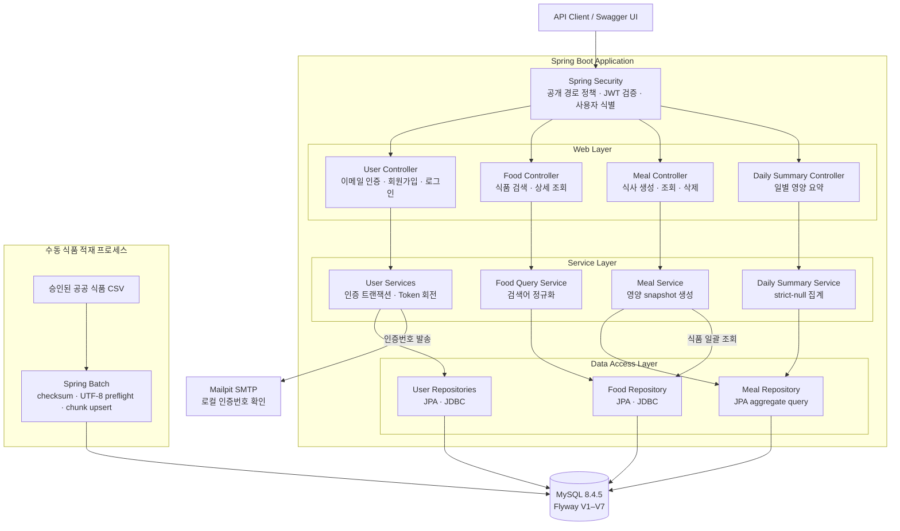
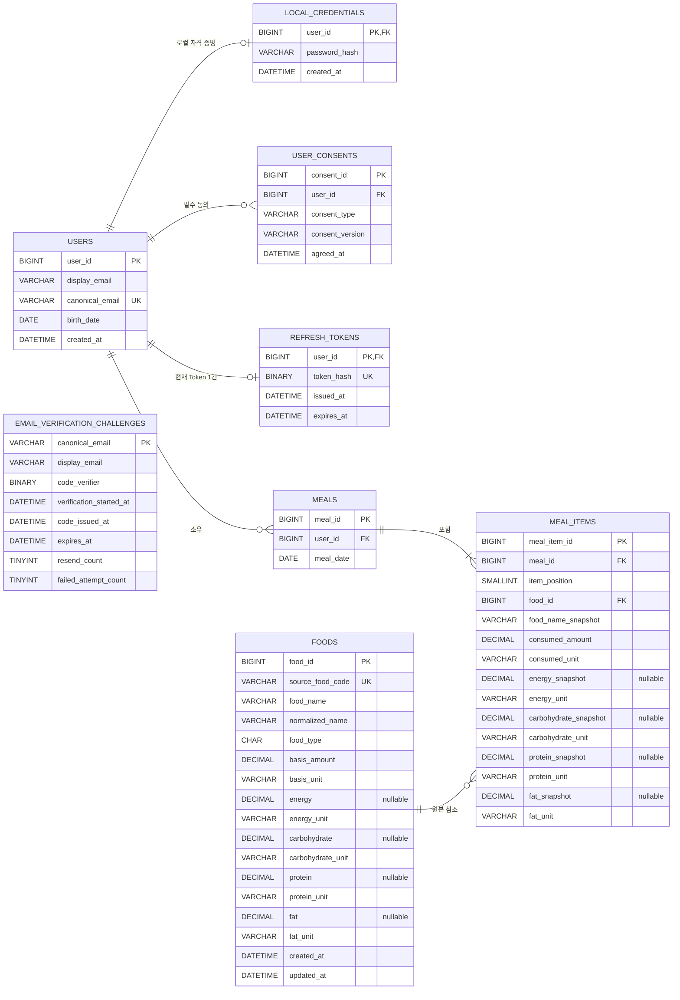

# Nyamlog

> 인증 사용자가 공공 식품 데이터를 검색해 식사를 기록하고, 기록 당시의 영양정보를 바탕으로 일별 합계를 확인하는 Spring Boot 백엔드입니다.

## 왜 Nyamlog인가

식사 기록은 단순히 현재 식품 정보를 조회해 합산하는 기능으로 끝나지 않습니다. 원본 식품 데이터가 나중에 변경되더라도 과거 기록은 그대로 남아야 하고, 영양값이 누락된 경우 이를 0이나 불완전한 부분합으로 보여주지 않아야 합니다. 사용자별 기록도 요청 파라미터가 아니라 인증 정보에 따라 분리되어야 합니다.

Nyamlog는 이 세 가지 데이터 무결성 문제를 중심으로 회원가입부터 일별 영양 요약까지 하나의 백엔드 수직 흐름을 구현했습니다.

| 식사 기록에서 생기는 문제 | Nyamlog의 처리 방식 | 보장하는 결과 |
| --- | --- | --- |
| 원본 식품 정보가 바뀌면 과거 기록도 달라질 수 있음 | 식사 생성 시 식품명·섭취량·주요 영양값을 snapshot으로 저장 | 과거 기록이 현재 식품 변경과 독립적임 |
| 누락된 영양값을 0 또는 알려진 값만의 부분합으로 표시할 수 있음 | 전체 항목 수와 영양소별 값 존재 수를 함께 집계 | 누락이 하나라도 있으면 해당 영양소를 `value: null`, `complete: false`로 반환 |
| 요청값으로 사용자를 선택하면 다른 사용자의 데이터에 접근할 수 있음 | Spring Security가 검증한 JWT subject에서 소유자를 결정 | 식사 조회·삭제·집계를 사용자별로 격리 |
| Refresh Token을 그대로 저장하거나 동시에 여러 번 회전할 수 있음 | SHA-256 hash만 저장하고 조건부 갱신으로 회전 | 원문 비노출과 동시 요청의 단일 성공 보장 |

## 프로젝트 소개

Nyamlog는 Spring Boot와 MySQL의 핵심 백엔드 개념을 직접 구현하고 설명하기 위한 개인 학습·포트폴리오 프로젝트입니다. 현재 서버 범위는 이메일 인증과 회원가입, 로컬 로그인, 공공 식품 적재·조회, 식사 기록, 일별 영양 요약까지입니다.

상용 서비스나 불특정 다수 대상 운영보다 한 명의 개발자가 배포해 직접 사용하고 소수 지인이 체험할 수 있는 작은 수직 흐름을 목표로 합니다. 프런트엔드, 소셜 로그인, 추천·진단, 대규모 트래픽과 고가용성 인프라는 현재 구현 범위에 포함하지 않습니다.

## 핵심 흐름

```text
Mailpit 인증번호 발송
        │
        ▼
이메일 + 인증번호로 회원가입 ── BCrypt 자격 증명·필수 동의 저장
        │
        ▼
로컬 로그인 ── Access Token + HttpOnly Refresh Token
        │
        ▼
공공 식품 검색 ── 식품 선택과 섭취량 입력
        │
        ▼
식사 기록 ── 기록 시점의 식품명·영양값 snapshot 저장
        │
        ▼
날짜별 식사 조회 ── snapshot 단일 집계 ── 일별 영양 요약
```

## 핵심 기능

### 1. 이메일 인증과 회원가입

- 로컬 Mailpit으로 6자리 인증번호를 발송합니다.
- 인증 challenge를 MySQL에 저장하고 만료, 재발송 횟수, 실패 횟수와 동시 요청을 관리합니다.
- 회원가입 시 이메일과 인증번호를 직접 검증하고 사용자, BCrypt 자격 증명, 필수 동의 3건을 하나의 트랜잭션으로 저장합니다.
- 일부 저장이 실패하면 가입 데이터와 인증 challenge 변경을 모두 rollback합니다.
- 비밀번호, 인증번호, hash와 내부 오류는 응답·로그·OpenAPI 예시에 노출하지 않습니다.

### 2. 로컬 로그인과 토큰 회전

- 로그인 성공 시 15분 Access Token과 30일 Refresh Token을 발급합니다.
- Access Token은 HS256 JWT이며 issuer, audience, 만료 시각과 양의 사용자 subject를 검증합니다.
- Refresh Token 원문은 `Secure`, `HttpOnly`, `SameSite=Strict` 쿠키로만 전달하고 MySQL에는 SHA-256 hash만 저장합니다.
- refresh 요청은 고정 CSRF 표지를 확인하고, 조건부 갱신으로 동시에 들어온 회전 요청 중 하나만 성공시킵니다.
- 로그아웃은 현재 Refresh Token 서버 상태를 폐기하며 이미 만료되거나 없는 요청도 안전하게 처리합니다.

### 3. 공공 식품 데이터 적재와 조회

- 승인된 공공 식품 CSV를 일반 API 실행과 분리된 수동 Spring Batch Job으로 적재합니다.
- 전체 파일의 checksum과 strict UTF-8을 쓰기 전에 검증하고, 500건 chunk 단위로 MySQL에 upsert합니다.
- 원본에서 비어 있는 영양값은 숫자 0으로 치환하지 않고 `NULL`로 보존합니다.
- 식품명 검색은 NFKC·공백·소문자 정규화와 binary collation을 사용해 case·accent 차이를 명시적으로 처리합니다.
- 인증 사용자는 식품명 prefix 검색과 식품 상세 조회 API를 사용할 수 있습니다.

### 4. 식사 기록과 영양 snapshot

- 사용자는 식사 날짜와 1~20개 식품의 식별자·섭취량만 제출합니다.
- 서버가 식품을 한 번에 조회하고 섭취량 비율에 따라 영양값을 계산한 뒤 한 트랜잭션으로 저장합니다.
- 식사 항목은 기록 당시의 식품명, 섭취량, 단위, 에너지·탄수화물·단백질·지방을 snapshot으로 보존합니다.
- 한 항목이라도 유효하지 않으면 식사 전체를 rollback합니다.
- 목록 조회는 사용자와 날짜로 제한하고, 식사별 추가 조회 없이 중첩 응답을 구성합니다.

### 5. 일별 영양 요약

- 요청 날짜의 현재 사용자 `meal_items` snapshot만 하나의 aggregate query로 집계합니다.
- 에너지·탄수화물·단백질·지방마다 `value`, `unit`, `complete`를 반환합니다.
- 특정 영양소가 하나라도 누락되면 알려진 값만의 부분합을 노출하지 않습니다.
- 기록이 없는 날짜는 `mealItemCount: 0`, 네 영양소 합계 0, `complete: true`로 반환해 실제 합계가 0인 기록과 구분합니다.
- 집계 결과를 별도 테이블에 중복 저장하지 않아 snapshot을 단일 진실 공급원으로 유지합니다.

## 아키텍처



도메인별로 `user`, `food`, `meal`, `dailysummary` 패키지를 나누고, Controller는 HTTP 처리, Service는 비즈니스 규칙과 트랜잭션, Repository는 데이터 접근을 담당합니다. 공개 API는 JPA Entity를 직접 반환하지 않습니다.

## ERD



`email_verification_challenges`는 가입 전 상태이므로 `users`와 FK로 연결하지 않고, 회원가입 성공 시 같은 트랜잭션에서 소비합니다. `meal_items`는 현재 `foods` 값이 아니라 기록 시점 snapshot을 보관하며, 원본 식품 삭제는 `RESTRICT`됩니다. `daily-summary`는 별도 테이블 없이 이 snapshot을 조회 시점에 집계합니다.

스키마는 Flyway V1~V7로 관리하며 운영 설정에서 Hibernate `ddl-auto`는 `validate`, Spring SQL 및 Batch schema 자동 초기화는 비활성화합니다. ERD에서는 애플리케이션 도메인 테이블만 다루고 Spring Batch 메타데이터 테이블은 제외했습니다.

## 기술 스택

| 영역 | 구성 |
| --- | --- |
| Language | Java 17 |
| Framework | Spring Boot 3.5.10 |
| Web | Spring MVC, Bean Validation, springdoc-openapi 2.8.17 |
| Security | Spring Security, OAuth2 Resource Server, JWT, BCrypt |
| Persistence | Spring Data JPA, JDBC, MySQL 8.4.5 |
| Data Migration | Flyway |
| Batch | Spring Batch |
| Mail | Spring Mail, Mailpit 1.30.7 |
| Test | JUnit 5, MockMvc, Testcontainers |
| Build / Local Infra | Gradle, Docker Compose |

## API

| Method | Endpoint | 인증 | 역할 |
| --- | --- | --- | --- |
| `POST` | `/api/v1/auth/email-verifications` | 공개 | 회원가입 인증번호 발송 |
| `POST` | `/api/v1/auth/signup` | 공개 | 이메일·인증번호 검증 후 계정 생성 |
| `POST` | `/api/v1/auth/login` | 공개 | Access/Refresh Token 발급 |
| `POST` | `/api/v1/auth/refresh` | Cookie + CSRF 표지 | Refresh Token 회전과 Access Token 재발급 |
| `POST` | `/api/v1/auth/logout` | Cookie + CSRF 표지 | Refresh Token 서버 상태 폐기 |
| `GET` | `/api/v1/auth/me` | Bearer | 현재 인증 사용자 조회 |
| `GET` | `/api/v1/foods/search?query=...` | Bearer | 식품명 prefix 검색 |
| `GET` | `/api/v1/foods/{foodId}` | Bearer | 식품 상세와 영양정보 조회 |
| `POST` | `/api/v1/meals` | Bearer | 식사와 영양 snapshot 생성 |
| `GET` | `/api/v1/meals?date=YYYY-MM-DD` | Bearer | 날짜별 자기 식사 목록 조회 |
| `DELETE` | `/api/v1/meals/{mealId}` | Bearer | 소유한 식사 삭제 |
| `GET` | `/api/v1/daily-summaries?date=YYYY-MM-DD` | Bearer | 일별 영양 snapshot 합계 조회 |

모든 응답은 공통 `ApiResponse` 형식을 사용합니다. Swagger UI와 OpenAPI 문서는 `NYAM_OPENAPI_ENABLED=true`일 때만 활성화되며, 민감한 요청 필드는 `writeOnly`로 문서화합니다.

## 프로젝트 구조

```text
.
├── docs/
│   ├── 01-plan/features/       # 기능별 Plan
│   ├── 02-design/features/     # 구현 결정과 공개 계약
│   ├── 03-analysis/            # Design-구현 gap 및 검증 근거
│   └── 04-report/              # 기능 완료 기록
├── src/main/java/com/nyam/
│   ├── domain/user/            # 이메일 인증·회원가입·로그인
│   ├── domain/food/            # Batch 적재·식품 조회
│   ├── domain/meal/            # 식사·영양 snapshot
│   ├── domain/dailysummary/    # 일별 영양 집계
│   └── global/                 # 공통 응답·예외·보안
├── src/main/resources/
│   └── db/migration/           # Flyway V1~V7
├── src/test/java/com/nyam/     # 단위·Web·OpenAPI·실제 MySQL 테스트
└── docker-compose.yml          # MySQL 8.4.5·Mailpit
```

## 검증

daily-summary 완료 시점에 전체 회귀 테스트를 실제 Docker 환경에서 새로 실행했습니다.

| 항목 | 결과 |
| --- | --- |
| 전체 테스트 | 39 suites, 129 passed, 0 failed, 0 errors, 0 skipped |
| 기준 데이터베이스 | MySQL 8.4.5 |
| Migration | V1~V7 fresh migration 및 Hibernate schema validation 통과 |
| 실제 MySQL 검증 | 인증 transaction·동시성, Batch, snapshot, 사용자 격리, 단일 집계 query 통과 |
| Mail 흐름 | Mailpit 인증번호 발송부터 직접 signup까지 통과 |
| JavaDoc | 생성 성공 |
| Design 일치율 | daily-summary 22/22, 100% |

식품 Batch는 승인된 공공 원본 317,766건 전체 적재에서도 `readCount=317,766`, `writeCount=317,766`, skip 0, rollback 0을 확인했습니다. 원본 CSV와 로컬 경로는 저장소에 포함하지 않습니다.

상세 근거는 각 기능의 [Completion Report](docs/04-report/)와 [Analysis](docs/03-analysis/)에 기록되어 있습니다.

```powershell
.\gradlew.bat test javadoc
```

Docker를 사용할 수 없어 Testcontainers 테스트가 실행되지 않은 경우의 Gradle 성공은 실제 MySQL 검증 완료로 간주하지 않습니다.

## 로컬 실행

### 1. 준비물

- JDK 17
- Docker Desktop과 Docker Compose

### 2. 환경 변수

저장소 루트의 로컬 `.env`에 다음 변수를 설정합니다. 실제 비밀번호와 Base64 secret은 커밋하거나 문서·로그에 남기지 않습니다.

| 변수 | 용도 |
| --- | --- |
| `MYSQL_DB` | Compose가 생성할 데이터베이스 이름 |
| `MYSQL_USERNAME` | 애플리케이션용 비-root 사용자 |
| `MYSQL_PASSWORD` | 애플리케이션 DB 비밀번호 |
| `MYSQL_ROOT_PASSWORD` | MySQL 컨테이너 초기화 전용 비밀번호 |
| `MYSQL_PORT` | 호스트 MySQL 포트, 미지정 시 `3306` |
| `MYSQL_URL` | 위 포트·데이터베이스와 일치하는 JDBC URL |
| `NYAM_EMAIL_VERIFICATION_HMAC_SECRET` | 인증번호 검증용 Base64 secret |
| `NYAM_AUTH_ACCESS_SECRET` | JWT HS256 서명용 Base64 secret, decode 후 32바이트 이상 |
| `NYAM_OPENAPI_ENABLED` | 로컬 Swagger/OpenAPI 활성화 여부 |

### 3. MySQL과 Mailpit 실행

```powershell
docker compose up -d
docker compose ps
```

### 4. 애플리케이션 실행

```powershell
.\gradlew.bat bootRun
```

`NYAM_OPENAPI_ENABLED=true`인 로컬 환경에서는 `http://localhost:8080/swagger-ui/index.html`, Mailpit은 `http://localhost:8025`에서 확인할 수 있습니다.

### 5. 식품 데이터 적재

식품 원본은 저장소에 포함하지 않습니다. 승인된 CSV의 경로, release date와 SHA-256 checksum을 실행 환경에 설정한 뒤 수동 Job을 실행합니다.

```powershell
$env:NYAM_FOOD_IMPORT_PATH = '<approved-csv-path>'
$env:NYAM_FOOD_IMPORT_RELEASE_DATE = 'YYYY-MM-DD'
$env:NYAM_FOOD_IMPORT_CHECKSUM = '<sha256>'
.\gradlew.bat foodImport
```

## 현재 범위

- 완료: project foundation, 이메일 인증·회원가입, 로컬 로그인, 식품 적재·조회, 식사 기록, 일별 영양 요약
- 다음 독립 기능: social-login
- 현재 제외: 프런트엔드, 추천·진단·치료, 기간 통계·차트, 상용 메일, 캐시, 대규모 운영 인프라
